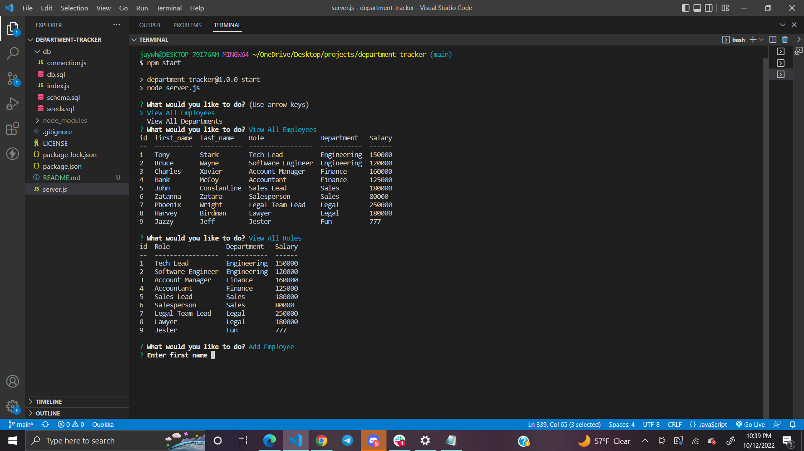

# Department Tracker
[]
# Description
A command-line application to manage a company's employee database, using Node.js, Inquirer, and MySQL.
# Table of Contents
* [Installation](#installation)
* [Usage](#usage)
* [License](#license)
* [Contributing](#contributing)
* [Questions](#questions)
# Installation
The following necessary dependencies must be installed to run the application:
- Inquirer
- MySql2
- Node.js
- Console.table
# Usage

In order to use this app, Download or copy repository, install all dependencies. Open mysql and login (You can do this by typing <mysql -u root -p> then entering the password) source the database using the db and schema.sql files. In the terminal type "npm start" to begin running the app.
# License
This project is licensed under the MIT License license.
# Contributing
Contributors: Tyler Mason (JayWhiteBuffalo), Joshua Hawkins
# Tests
N/A
# Questions
If you have any questions, contact:

 JayWhiteBuffalo@protonmail.com

 Link to GitHub:

https://github.com/JayWhiteBuffalo
